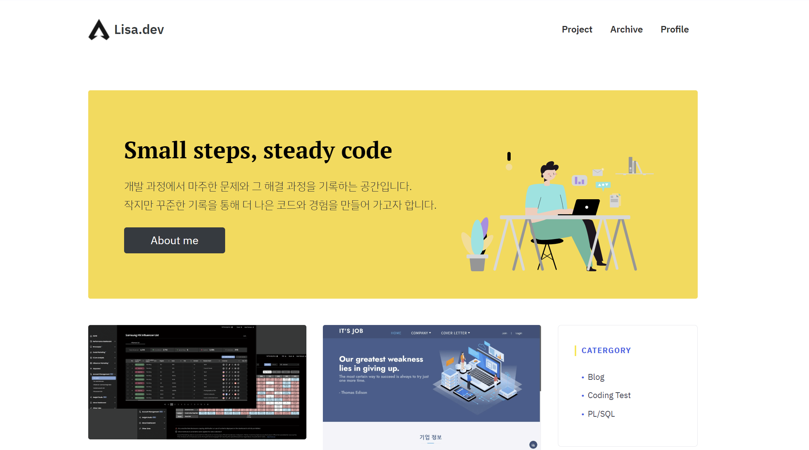

# 리사의 개발 블로그 (Lisa'dev)

프론트엔드를 중심으로 디자인, 백엔드까지 아우르는 웹 개발자의 기술 블로그이자 포트폴리오입니다.  
GitHub Pages + Jekyll 기반으로 운영하며, CI/CD 자동화를 통해 관리하고 있습니다.  

👉 [블로그 바로가기](https://hsyeun.github.io/)

---

## 👩‍💻 About Me
* React & TypeScript 기반 UI/UX 중심 프론트엔드 개발 주력
* Spring Boot, Kotlin, Java를 활용한 백엔드 API 설계·구현 경험
* Figma, Photoshop, Illustrator 등을 활용한 UI 설계 및 시각 디자인 경험

👉 [Profile 바로가기](https://hsyeun.github.io/profile/)

  
  

